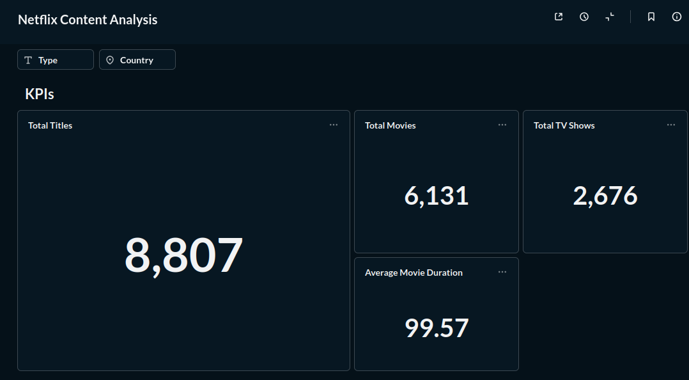
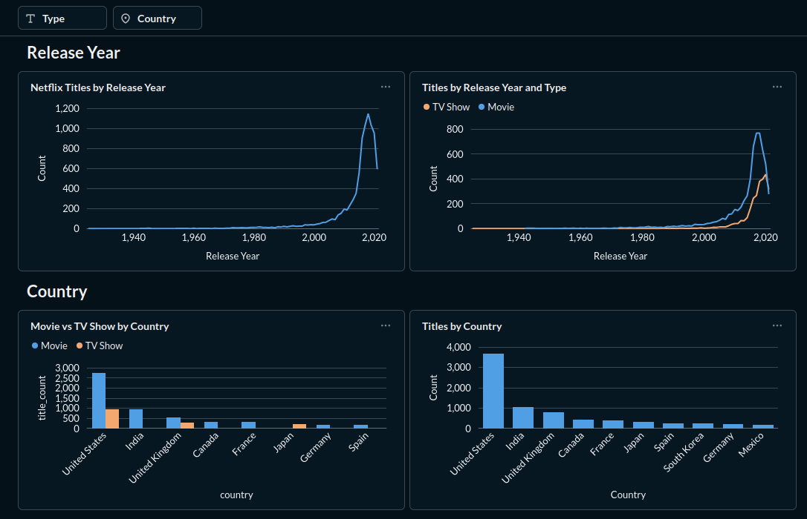
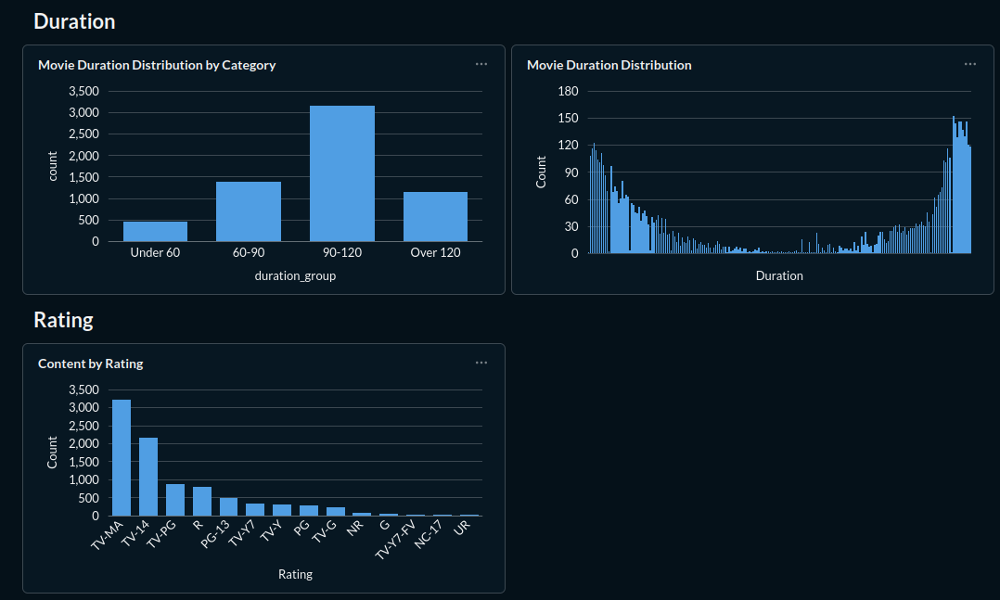

# Netflix Data Analysis

## Project Overview

This project explores the Netflix titles dataset to identify patterns in Netflix's content library.

The analysis focuses on content type, release years, content age groups, movie durations, and countries represented in the dataset. The project also includes a dashboard created with Metabase to present the main findings visually.

## Dataset

The dataset contains information about Netflix movies and TV shows, including:

* Title
* Type
* Director
* Cast
* Country
* Date Added
* Release Year
* Rating
* Duration
* Genre
* Description

The original dataset contains 8,807 titles.

## Data Cleaning

The dataset was cleaned and prepared before analysis. The cleaning process included:

* Handling missing and inconsistent values
* Identifying and correcting duration-related values that were incorrectly stored in the `rating` column
* Converting movie durations into numeric values using a new `duration_min` column
* Creating a `duration_group` column to categorize movies by duration
* Separating country information into a dedicated table for country-level analysis

## Tools & Technologies

* Python
* Jupyter Notebook
* Pandas
* Excel
* Pivot Tables
* MySQL
* SQL
* Metabase
* GitHub

## Analysis

The analysis includes:

* Distribution of Movies and TV Shows
* Titles by release year
* Content age groups
* Movie duration groups
* Content distribution by country
* Movie vs. TV Show distribution across the top 10 countries

The analysis was supported by Excel Pivot Tables, SQL queries, and Python-based data exploration.

## Dashboard

The final analysis was visualized in a Metabase dashboard.

The dashboard includes KPI cards, charts, and filters for exploring Netflix's content library.

### Dashboard Screenshots

#### Dashboard Overview



#### Dashboard Analysis



#### Country Analysis



## Key Insights

* Netflix's catalog contains both Movies and TV Shows, with Movies representing the larger share of titles.
* The dataset contains titles released across several decades, with a large concentration of more recent content.
* Movie durations are distributed across several duration groups, with medium-length movies representing a substantial portion of the catalog.
* The United States, India, and the United Kingdom are among the countries with the largest number of titles in the dataset.
* The dashboard provides an interactive way to explore these patterns by content type and other dimensions.

## Project Structure

```text
netflix-data-analysis/
├── netflix_data_analysis.ipynb
├── netflix_titles.csv
├── netflix_country.csv
└── screenshots/
    ├── dashboard_1.png
    ├── dashboard_2.png
    └── dashboard_3.png
```

## Project Goal

The goal of this project is to demonstrate a practical data analysis workflow, from data cleaning and SQL analysis to Excel-based analysis, data visualization, and dashboard development.
